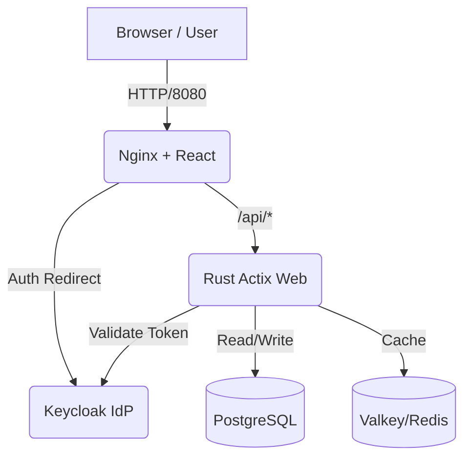

# App Template - Full Stack Rust & React Template

**App Template** is a robust, production-ready reference implementation for building full-stack applications. It combines the performance and safety of **Rust** on the backend with the interactivity of **React** on the frontend, securely authenticated via **Keycloak**.

## 🏗 Architecture

The application is fully containerized and orchestrated using Docker Compose.



*   **Frontend**: React (Vite) served by Nginx. Acts as a reverse proxy for API requests.
*   **Backend**: Rust (Actix Web). High-performance asynchronous API.
*   **Authentication**: Keycloak (OIDC). Handles user identity and access management.
*   **Database**: PostgreSQL. Persistent relational data storage.
*   **Cache**: Valkey (Redis). In-memory data structure store for caching.

## 🚀 Getting Started

### Prerequisites
*   Docker (or Podman)
*   Docker Compose

### running the App
1.  **Start the stack**:
    ```bash
    docker-compose up --build -d
    ```
    *(Note: The first run may take a few minutes to download images and compile Rust dependencies.)*

2.  **Access the Application**:
    *   **Frontend**: [http://localhost:8080](http://localhost:8080)
    *   **Keycloak Admin**: [http://localhost:8180](http://localhost:8180) (Admin: `admin`/`admin`)

3.  **Test the Flow**:
    *   Go to `http://localhost:8080`.
    *   Click **"Sign in with Keycloak"**.
    *   **User Credentials**:
        *   Username: `sanket`
        *   Password: `password`
    *   Once logged in, click **"Get Greeting & Joke"**.
    *   You will see a greeting (public API) and a random programming joke (protected API, cached).

## 🛠 Using this as a Template

To use this project as a foundation for your own application:

### 1. Backend (Rust)
*   **Location**: `./hello_actix`
*   **Add Endpoints**: Edit `src/main.rs`. Define new services and add them to the `App::new()` builder.
*   **Database Models**: Use `sqlx`. Add migrations in `init.sql` (or setup sqlx-cli) and create corresponding Rust structs.
*   **Dependencies**: Add crates to `hello_actix/Cargo.toml`.

### 2. Frontend (React)
*   **Location**: `./hello_frontend`
*   **Components**: Add new React components in `src/`.
*   **API Calls**: Use the `fetch` API. Requests to `/api/...` are automatically proxied to the backend.
*   **Auth**: Use the `useAuth()` hook from `react-oidc-context` to access user info and tokens.

### 3. Authentication (Keycloak)
*   **Configuration**: Modify `keycloak/realm-export.json` to define your own roles, clients, and predefined users.
*   **Theme**: Mount custom themes to the Keycloak container if needed.

### 4. Infrastructure
*   **Ports**: Update `docker-compose.yml` if you need to expose different ports.
*   **Environment**: Manage sensitive secrets (DB passwords, etc.) using a `.env` file (ensure it's git-ignored).

## 📦 Project Structure

```
├── docker-compose.yml   # Orchestration for all services
├── init.sql             # SQL script to initialize Postgres DB
├── hello_actix/         # Rust Backend
│   ├── src/main.rs      # Main API logic & Auth validation
│   └── Dockerfile       # Multi-stage Rust build
├── hello_frontend/      # React Frontend
│   ├── src/             # UI Components & Auth logic
│   ├── nginx.conf       # Nginx proxy config
│   └── Dockerfile       # Node build + Nginx serve
└── keycloak/            # Keycloak Configuration
    ├── Dockerfile       # Custom Keycloak image
    └── realm-export.json# Realm import data
```

## 📜 License
[Your License Here]
