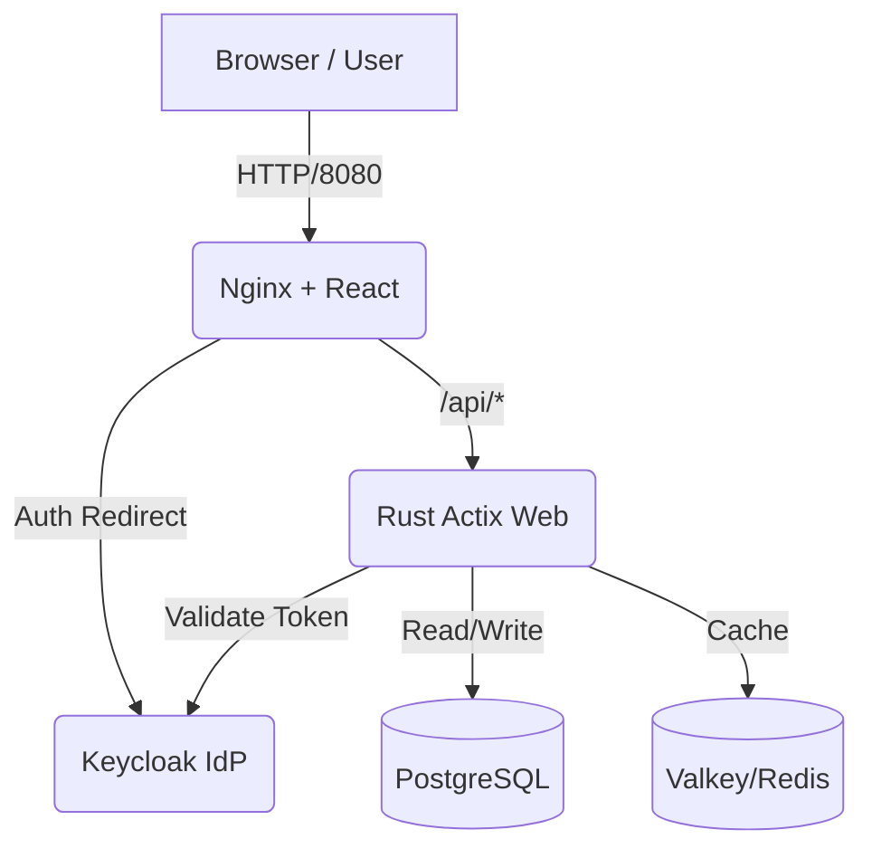

# App Template - Full Stack Rust & React Template

**App Template** is a robust, production-ready reference implementation for building full-stack applications. It combines the performance and safety of **Rust** on the backend with the interactivity of **React** on the frontend, securely authenticated via **Keycloak**.

## 🏗 Architecture

The application is fully containerized and orchestrated using Docker Compose.



*   **Frontend**: React (Vite) served by Nginx. Acts as a reverse proxy for API requests.
*   **Backend**: Rust (Actix Web). High-performance asynchronous API.
*   **Authentication**: Keycloak (OIDC). Handles user identity and access management.
*   **Database**: PostgreSQL. Persistent relational data storage.
*   **Cache**: Valkey (Redis). In-memory data structure store for caching.

## 🚀 Getting Started

### Prerequisites
*   Docker (or Podman)
*   Docker Compose

### Running Multiple Sandboxes

This template supports running multiple independent environments on the same machine.

1.  **Prepare a `.env` file**:
    ```bash
    cp .env.example .env.sandbox1
    ```
2.  **Edit `.env.sandbox1`**:
    ```env
    SANDBOX_NAME=sandbox1
    FRONTEND_PORT=8080
    KEYCLOAK_PORT=8180
    REALM_NAME=sandbox1-realm
    ```
3.  **Start the sandbox**:
    ```bash
    docker-compose --env-file .env.sandbox1 -p sandbox1 up --build -d
    ```
4.  **Repeat for another sandbox** using a different port and name:
    ```bash
    # In .env.sandbox2
    SANDBOX_NAME=sandbox2
    FRONTEND_PORT=8081
    KEYCLOAK_PORT=8181
    
    docker-compose --env-file .env.sandbox2 -p sandbox2 up --build -d
    ```

### Accessing the Application
*   **Frontend**: `http://localhost:${FRONTEND_PORT}`
*   **Keycloak Admin**: `http://localhost:${KEYCLOAK_PORT}`

### Stopping a Sandbox

To stop and remove the containers for a specific sandbox:

```bash
docker-compose --env-file .env.sandbox1 -p sandbox1 down
```

To also remove the data volumes (reset database and Keycloak):

```bash
docker-compose --env-file .env.sandbox1 -p sandbox1 down -v
```

## 🛠 Using this as a Template

To use this project as a foundation for your own application:

### 1. Backend (Rust)
*   **Location**: `./hello_actix`
*   **Add Endpoints**: Edit `src/main.rs`. Define new services and add them to the `App::new()` builder.
*   **Database Models**: Use `sqlx`. Add migrations in `init.sql` (or setup sqlx-cli) and create corresponding Rust structs.
*   **Dependencies**: Add crates to `hello_actix/Cargo.toml`.

### 2. Frontend (React)
*   **Location**: `./hello_frontend`
*   **Components**: Add new React components in `src/`.
*   **API Calls**: Use the `fetch` API. Requests to `/api/...` are automatically proxied to the backend.
*   **Auth**: Use the `useAuth()` hook from `react-oidc-context` to access user info and tokens.

### 3. Authentication (Keycloak)
*   **Configuration**: Modify `keycloak/realm-export.json` to define your own roles, clients, and predefined users.
*   **Theme**: Mount custom themes to the Keycloak container if needed.

### How Parameterization Works

The sandbox isolation is achieved through a multi-layered environment variable flow:

#### 1. Docker Compose Layer
*   **`.env` files**: Variables like `SANDBOX_NAME` and `FRONTEND_PORT` are loaded by Docker Compose.
*   **Project Name (`-p`)**: Ensures that Docker volumes and networks are unique to each sandbox.
*   **Port Mapping**: `${FRONTEND_PORT:-8080}:80` maps unique host ports to standard internal ports.

#### 2. Build Time (Keycloak)
*   **`ARG FRONTEND_URL`**: Passed during `docker-compose build`.
*   **Multi-stage Build**: The `keycloak/Dockerfile` uses an Alpine stage to run `envsubst`, replacing `${FRONTEND_URL}` placeholders in the `realm-export.json` before copying the final result into the Keycloak image.

#### 3. Runtime (Frontend)
*   **`docker-entrypoint.sh`**: When the Nginx container starts, this script generates a `window._env_` configuration file (`env.js`) from the `KEYCLOAK_URL` environment variable.
*   **`main.jsx`**: The React app reads `window._env_.KEYCLOAK_URL` to configure the OIDC authority. This allows the same image to work regardless of which port Keycloak is mapped to on the host.

#### 4. Runtime (Backend)
*   **`std::env::var`**: The Rust application fetches `DATABASE_URL`, `REDIS_URL`, and `OIDC_JWKS` directly from its environment. These are injected by Docker Compose using service names (e.g., `app_db`) which remain constant within each sandbox's private network.

## 📦 Project Structure

```
├── docker-compose.yml   # Orchestration for all services
├── init.sql             # SQL script to initialize Postgres DB
├── hello_actix/         # Rust Backend
│   ├── src/main.rs      # Main API logic & Auth validation
│   └── Dockerfile       # Multi-stage Rust build
├── hello_frontend/      # React Frontend
│   ├── src/             # UI Components & Auth logic
│   ├── nginx.conf       # Nginx proxy config
│   └── Dockerfile       # Node build + Nginx serve
└── keycloak/            # Keycloak Configuration
    ├── Dockerfile       # Custom Keycloak image
    └── realm-export.json# Realm import data
```

## 📜 License
[Your License Here]
